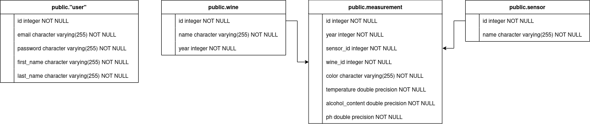

# New Wine Rest API
The Wine API provides an interface for managing sensors, wines, and measurements. It allows user authentication, registering new sensors and measurements, and retrieving information about sensors and wines with their respective measurements.

## Requirements
- PHP 8.1 or higher
- Composer
- Symfony 7.x
- Database PostgreSQL

## Installation
Install Symfony

https://symfony.com/download

Install PostgreSQL

https://www.postgresql.org/download/

Install dependencies:

    composer install
    composer require nelmio/api-doc-bundle
    composer require twig asset

## Usage
    cd new_wine_api/
    symfony server:start

## API Documentation
API Swagger documentation is available at:
https://localhost:8000/api/doc

## E-R diagram

## PostgreSQL database dump
[schema.sql](schema.sql)

## Other information
There is also a example web page available at https://localhost:8000 for testing purposes.
It includes Register, Login, and Sensor/Measurement Register and Show functionalities.

